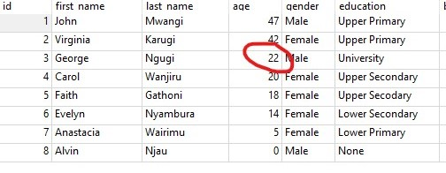
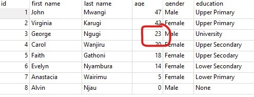

SQL - Notes Continued
================
Mwangi George
2022-10-15

``` r
# loading important packages
pacman::p_load(
              tidyverse, 
              DBI, 
              RSQLite
              )
```

    ## Warning: unable to access index for repository http://cran.rstudio.com/src/contrib:
    ##   cannot open URL 'http://cran.rstudio.com/src/contrib/PACKAGES'

    ## Warning: unable to access index for repository http://www.stats.ox.ac.uk/pub/RWin/src/contrib:
    ##   cannot open URL 'http://www.stats.ox.ac.uk/pub/RWin/src/contrib/PACKAGES'

    ## Warning: package 'tidyverse' is not available for this version of R
    ## 
    ## A version of this package for your version of R might be available elsewhere,
    ## see the ideas at
    ## https://cran.r-project.org/doc/manuals/r-patched/R-admin.html#Installing-packages

    ## Warning: unable to access index for repository http://cran.rstudio.com/bin/windows/contrib/4.2:
    ##   cannot open URL 'http://cran.rstudio.com/bin/windows/contrib/4.2/PACKAGES'

    ## Warning: unable to access index for repository http://www.stats.ox.ac.uk/pub/RWin/bin/windows/contrib/4.2:
    ##   cannot open URL 'http://www.stats.ox.ac.uk/pub/RWin/bin/windows/contrib/4.2/PACKAGES'

    ## Warning: 'BiocManager' not available.  Could not check Bioconductor.
    ## 
    ## Please use `install.packages('BiocManager')` and then retry.

    ## 
    ## tidyverse installed

    ## Warning in pacman::p_load(tidyverse, DBI, RSQLite): Failed to install/load:
    ## tidyverse

``` r
# creating another connection
main_conn <- dbConnect(SQLite(),
                       "C:\\Users\\Admin\\Documents\\learningSQL\\SQl.sqlite")

#main_conn contains several tables as shown below
dbListTables(conn = main_conn)
```

    ##  [1] "albums"         "bands"          "base_data"      "fam_Info"      
    ##  [5] "laterite"       "lemonade_stand" "product_full"   "product_info"  
    ##  [9] "product_stats"  "product_table"  "product_tests"

## INSERT INTO

The INSERT INTO statement is used to insert a new row in a table. It is
possible to write the INSERT INTO statement in two forms. The first form
doesn’t specify the column names where the data will be inserted, only
their values:

`INSERT INTO table_name VALUES (value1, value2, value3,...)`

The second form specifies both the column names and the values to be
inserted:

`INSERT INTO table_name (column1, column2, column3,...) VALUES (value1, value2, value3,...)`

-   **Examples** Let’s view the records in the table fam_info

``` sql
SELECT * 
FROM fam_info 
```

| id  | first_name | last_name | age | gender | education       | body_height_cm | body_weight_kg | shoe_size | marital_status |
|:----|:-----------|:----------|----:|:-------|:----------------|---------------:|---------------:|----------:|:---------------|
| 1   | John       | Mwangi    |  47 | Male   | Upper Primary   |            180 |             88 |        45 | married        |
| 2   | Virginia   | Karugi    |  42 | Female | Upper Primary   |            155 |             85 |        40 | married        |
| 3   | George     | Ngugi     |  22 | Male   | University      |            178 |             65 |        44 | single         |
| 4   | Carol      | Wanjiru   |  20 | Female | Upper Secondary |            150 |             70 |        39 | married        |
| 5   | Faith      | Gathoni   |  18 | Female | Upper Secodary  |            165 |             73 |        40 | single         |
| 6   | Evelyn     | Nyambura  |  14 | Female | Lower Secondary |            145 |             55 |        38 | single         |
| 7   | Anastacia  | Wairimu   |   5 | Female | Lower Primary   |             80 |             30 |        20 | single         |
| 8   | Alvin      | Njau      |   0 | Male   | None            |             50 |             10 |        15 | single         |

8 records

``` sql
INSERT INTO 
fam_info
        VALUES(
               9, 
               'Raymond', 
               'Mwangi', 
                NULL, 
               'Male', 
               'None', 
               20, 
               3, 
               10, 
               'single'
               )
```

Updated records from the table fam_info

``` sql
SELECT * 
FROM fam_info 
```

| id  | first_name | last_name | age | gender | education       | body_height_cm | body_weight_kg | shoe_size | marital_status |
|:----|:-----------|:----------|----:|:-------|:----------------|---------------:|---------------:|----------:|:---------------|
| 1   | John       | Mwangi    |  47 | Male   | Upper Primary   |            180 |             88 |        45 | married        |
| 2   | Virginia   | Karugi    |  42 | Female | Upper Primary   |            155 |             85 |        40 | married        |
| 3   | George     | Ngugi     |  22 | Male   | University      |            178 |             65 |        44 | single         |
| 4   | Carol      | Wanjiru   |  20 | Female | Upper Secondary |            150 |             70 |        39 | married        |
| 5   | Faith      | Gathoni   |  18 | Female | Upper Secodary  |            165 |             73 |        40 | single         |
| 6   | Evelyn     | Nyambura  |  14 | Female | Lower Secondary |            145 |             55 |        38 | single         |
| 7   | Anastacia  | Wairimu   |   5 | Female | Lower Primary   |             80 |             30 |        20 | single         |
| 8   | Alvin      | Njau      |   0 | Male   | None            |             50 |             10 |        15 | single         |
| 9   | Raymond    | Mwangi    |  NA | Male   | None            |             20 |              3 |        10 | single         |

9 records

Let’s inserts records into some columns of the table above

``` sql
INSERT INTO 
fam_info (
          id, 
          first_name, 
          age, body_height_cm, 
          marital_status
          )
          VALUES(
                 10, 'Jemma', 2, 40, 'single'
                 )
```

Updated records from the table fam_info

``` sql
SELECT * 
FROM fam_info 
```

| id  | first_name | last_name | age | gender | education       | body_height_cm | body_weight_kg | shoe_size | marital_status |
|:----|:-----------|:----------|----:|:-------|:----------------|---------------:|---------------:|----------:|:---------------|
| 1   | John       | Mwangi    |  47 | Male   | Upper Primary   |            180 |             88 |        45 | married        |
| 2   | Virginia   | Karugi    |  42 | Female | Upper Primary   |            155 |             85 |        40 | married        |
| 3   | George     | Ngugi     |  22 | Male   | University      |            178 |             65 |        44 | single         |
| 4   | Carol      | Wanjiru   |  20 | Female | Upper Secondary |            150 |             70 |        39 | married        |
| 5   | Faith      | Gathoni   |  18 | Female | Upper Secodary  |            165 |             73 |        40 | single         |
| 6   | Evelyn     | Nyambura  |  14 | Female | Lower Secondary |            145 |             55 |        38 | single         |
| 7   | Anastacia  | Wairimu   |   5 | Female | Lower Primary   |             80 |             30 |        20 | single         |
| 8   | Alvin      | Njau      |   0 | Male   | None            |             50 |             10 |        15 | single         |
| 9   | Raymond    | Mwangi    |  NA | Male   | None            |             20 |              3 |        10 | single         |
| 10  | Jemma      | NA        |   2 | NA     | NA              |             40 |             NA |        NA | single         |

Displaying records 1 - 10

## UPDATE

The UPDATE statement is used to update existing records in a table.

The syntax is as follows:

`UPDATE table_name`

`SET column1=value, column2=value2,...`

`WHERE some_column=some_value`

``` sql
-- this code updates the age from 22 to 23 where id is 3
UPDATE fam_info
SET age = 23
WHERE id = 3
```

**Before Update** 

**After Update** 

## DELETE

The DELETE statement is used to delete rows in a table.

Syntax:

`DELETE FROM table_name`

`WHERE some_column=some_value`

Note! The WHERE clause specifies which record or records that should be
deleted. If you omit the WHERE clause, all records will be deleted!

**Example**

**Before Deletion**

``` sql
SELECT COUNT(*) 
AS total_rows
FROM fam_info
```

| total_rows |
|-----------:|
|         10 |

1 records

**DELETION**

``` sql
DELETE FROM fam_info
WHERE id = 10
```

**After Deletion**

``` sql
SELECT COUNT(*) 
AS total_rows
FROM fam_info
```

| total_rows |
|-----------:|
|          9 |

1 records

### Deleting All Rows:

The syntax `DELETE FROM table_name` deletes all rows in a table but the
table structure, attributes, and indexes remain intact:

## SELECT

The SELECT statement is probably the most used SQL command. The SELECT
statement is used for retrieving rows from the database and enables the
selection of one or many rows or columns from one or many tables in the
database.

Syntax:

`select <column_names> from <table_names>`

Full Syntax:

\``SELECT`

`[ ALL | DISTINCT ]`

`[TOP ( expression ) [PERCENT] [ WITH TIES ] ]`

`select_list [ INTO new_table ]`

`[ FROM table_source ] [ WHERE search_condition ]`

`[ GROUP BY group_by_expression ]`

`[ HAVING search_condition ]`

`[ ORDER BY order_expression [ ASC | DESC ] ]`

## Operators

| Operator | Description                                      |
|----------|--------------------------------------------------|
| =        | Equal                                            |
| \<\>     | Not equal                                        |
| \>       | Greater than                                     |
| \<       | Less than                                        |
| \>=      | Greater than or equal                            |
| \<=      | Less than or equal                               |
| BETWEEN  | Between an inclusive range                       |
| LIKE     | Search for a pattern                             |
| IN       | Filling the exact value in at one of the columns |

## Wildcards

SQL wildcards can substitute for one or more characters when searching
for data in a database.

| Wildcard | Description                              |
|----------|------------------------------------------|
| %        | A substitute for zero or more characters |
| \_       | A substitute for exactly one character   |

**Example**

``` sql
SELECT *
FROM fam_info
WHERE first_name 
LIKE 'A%'
```

| id  | first_name | last_name | age | gender | education     | body_height_cm | body_weight_kg | shoe_size | marital_status |
|:----|:-----------|:----------|----:|:-------|:--------------|---------------:|---------------:|----------:|:---------------|
| 7   | Anastacia  | Wairimu   |   5 | Female | Lower Primary |             80 |             30 |        20 | single         |
| 8   | Alvin      | Njau      |   0 | Male   | None          |             50 |             10 |        15 | single         |

2 records

``` sql
SELECT *
FROM fam_info
WHERE first_name 
LIKE 'A_vin'
```

|  id | first_name | last_name | age | gender | education | body_height_cm | body_weight_kg | shoe_size | marital_status |
|----:|:-----------|:----------|----:|:-------|:----------|---------------:|---------------:|----------:|:---------------|
|   8 | Alvin      | Njau      |   0 | Male   | None      |             50 |             10 |        15 | single         |

1 records

## SELECT TOP Clause

The TOP clause is used to specify the number of records to return. The
TOP clause can be very useful on large tables with thousands of records.
Returning a large number of records can impact on performance.

Syntax:

`SELECT TOP number|percent column_name(s) FROM table_name`

-   In SQLite and some other relational database management systems, the
    `LIMIT` argument is used in place of the MS SQL Server `TOP`
    argument. In MS SQL Server, we can run
    `SELECT TOP 5 * FROM fam_info` to return the same output as that of
    the code below. `SELECT TOP 50 PERCENT * FROM fam_info` would return
    half of all records in a table.

**Example**

``` sql
SELECT * 
FROM fam_info 
LIMIT 5
```

| id  | first_name | last_name | age | gender | education       | body_height_cm | body_weight_kg | shoe_size | marital_status |
|:----|:-----------|:----------|----:|:-------|:----------------|---------------:|---------------:|----------:|:---------------|
| 1   | John       | Mwangi    |  47 | Male   | Upper Primary   |            180 |             88 |        45 | married        |
| 2   | Virginia   | Karugi    |  42 | Female | Upper Primary   |            155 |             85 |        40 | married        |
| 3   | George     | Ngugi     |  23 | Male   | University      |            178 |             65 |        44 | single         |
| 4   | Carol      | Wanjiru   |  20 | Female | Upper Secondary |            150 |             70 |        39 | married        |
| 5   | Faith      | Gathoni   |  18 | Female | Upper Secodary  |            165 |             73 |        40 | single         |

5 records

## ALIAS

You can give a table or a column another name by using an alias. This
can be a good thing to do if you have very long or complex table names
or column names. An alias name could be anything, but usually it is
short.

SQL Alias Syntax for Tables:

`SELECT column_name(s)`

`FROM table_name`

`AS alias_name`

SQL Alias Syntax for Columns:

`SELECT column_name AS alias_name`

`FROM table_name`

**Example**

``` sql
-- Aliasing column names
SELECT 
    body_height_cm AS HEIGHT,
    body_weight_kg AS WEIGHT
FROM fam_info
```

| HEIGHT | WEIGHT |
|-------:|-------:|
|    180 |     88 |
|    155 |     85 |
|    178 |     65 |
|    150 |     70 |
|    165 |     73 |
|    145 |     55 |
|     80 |     30 |
|     50 |     10 |
|     20 |      3 |

9 records

``` sql
SELECT 
      age, shoe_size
FROM fam_info 
AS f
```

| age | shoe_size |
|----:|----------:|
|  47 |        45 |
|  42 |        40 |
|  23 |        44 |
|  20 |        39 |
|  18 |        40 |
|  14 |        38 |
|   5 |        20 |
|   0 |        15 |
|  NA |        10 |

9 records

## Contact Me

[WhatsApp Me](https://wa.me/+254778988313) Follow me on
[Twitter](https://www.twitter.com/mwangi__george) and
[GitHub](https://github.com/mwangi-george)
